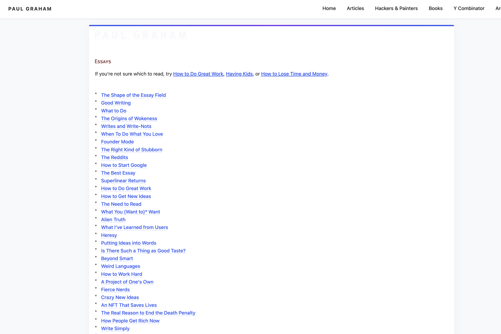

# Paul Graham Essay Viewer

A Chrome extension that transforms Paul Graham's essays into a modern, readable format with improved navigation and clean typography.


## Features

✨ **Modern Header Navigation**
- Clean horizontal menu with "PAUL GRAHAM" branding
- Smart "More" dropdown for additional menu items
- Sticky header that stays visible while scrolling

📖 **Enhanced Readability**
- ChatGPT-style sans-serif typography
- Optimized line height and spacing
- Softer text colors for comfortable reading
- Responsive design for all screen sizes

🎨 **Beautiful Design**
- Modern card-based layout
- Gradient accent bar
- Smooth hover effects
- Professional color scheme

🔒 **Privacy Focused**
- No data collection
- No external requests
- No tracking or analytics
- Runs entirely locally

## Installation

### From Source (Developer Mode)

1. Clone this repository:
   ```bash
   git clone https://github.com/ram-bakthavachalam-754/paul-graham-essays-viewer.git
   ```

2. Open Chrome and navigate to `chrome://extensions/`

3. Enable "Developer mode" (toggle in top-right corner)

4. Click "Load unpacked"

5. Select the `paul-graham-essays-viewer` directory

6. Visit [paulgraham.com](https://www.paulgraham.com/) to see the extension in action!

### From Chrome Web Store

*Coming soon!*

## Usage

Once installed, the extension automatically activates when you visit any page on `paulgraham.com`. No configuration needed!

## Screenshots




*The extension transforms Paul Graham's website with a modern header, clean typography, and improved readability.*

## Development

### Project Structure

```
paul-graham-essays-viewer/
├── manifest.json       # Extension configuration
├── content.js         # Main content script
├── styles.css         # Styling
├── icons/            # Extension icons
│   ├── icon16.png
│   ├── icon48.png
│   └── icon128.png
└── README.md
```

### Making Changes

1. Edit the files as needed
2. Go to `chrome://extensions/`
3. Click the reload icon on the extension card
4. Refresh the Paul Graham website to see changes

## Privacy Policy

This extension does not collect, store, or transmit any user data. It operates entirely locally within your browser and only modifies the visual presentation of paulgraham.com pages.

## Contributing

Contributions are welcome! Please feel free to submit a Pull Request.

## License

MIT License - feel free to use this code for your own projects!

## Credits

Created to enhance the reading experience of Paul Graham's excellent essays.

## Support

If you encounter any issues or have suggestions, please [open an issue](https://github.com/ram-bakthavachalam-754/paul-graham-essays-viewer/issues).
